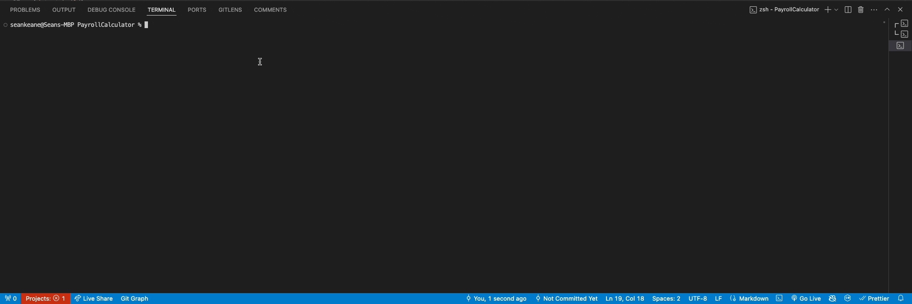

# Seans Punch Logic Test Solution for eBacon

#### By _**Sean Keane**_

####  07/07/2024

## Description

_I developed a backend program that calculates payroll information for a fictional construction company. It reads employee time punches and job metadata from JSON files, processes the data to compute regular, overtime, and double-time hours and generates detailed payroll reports. The project features robust error handling and scalability, demonstrating my proficiency in C#, data processing, and effective project management._

### Built Application

## Technology Used

* C#
* .NET 5.0
* Newtonsoft.Json

## Setup/Installation Requirements

1) Clone this repository to your desktop.
2) Navigate to the now installed directory and open in your editor of choice.
3) Open the PayrollCalculator folder with `cd PayrollCalculator`
3) Run the following commands in your terminal: 
`dotnet build`
`dotnet run`
4) The programs output should now be visibile in your terminal.

`dotnet clean`
`dotnet restore`
`dotnet build`
`dotnet run`

## Expected Output

Example JSON Output and Results to Test Against
{
  `"Mike": {
    "employee": "Mike",
    "regular": "39.2856",
    "overtime": "0.0000",
    "doubletime": "0.0000",
    "wageTotal": "1056.4017",
    "benefitTotal": "36.8320"
  },`
  `"Steve": {
    "employee": "Steve",
    "regular": "40.0000",
    "overtime": "8.0000",
    "doubletime": "1.1658",
    "wageTotal": "1653.5979",
    "benefitTotal": "49.9036"
  },`
  `"Alex": {
    "employee": "Alex",
    "regular": "40.0000",
    "overtime": "3.6428",
    "doubletime": "0.0000",
    "wageTotal": "795.3979",
    "benefitTotal": "44.5985"
  }`
}

## Known Bugs

* No known bugs.

## License

If you have any questions or concerns, feel free to contact me at code@sean-keane.com

*This is licensed under the MIT license*

Copyright (c) 07-7-2024 **_Sean Keane_**